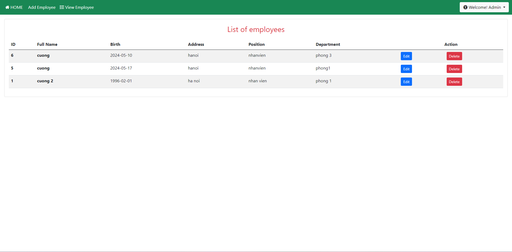

# Project name

Employee application for semester 4

# Demo


## Installation

You need to install docker to run
```bash
https://www.docker.com/products/docker-desktop/
```

## Usage
1. import ```data.sql``` in folder to create table Employee
2. Run ```docker compose up -d```


## Account

To login: 
1. Visit: http://localhost:8080/hello/admin/admin_login.jsp
2. user:admin@gmail.com,
3. password=admin

Please make sure following step.

## License

[MIT](https://choosealicense.com/licenses/mit/)